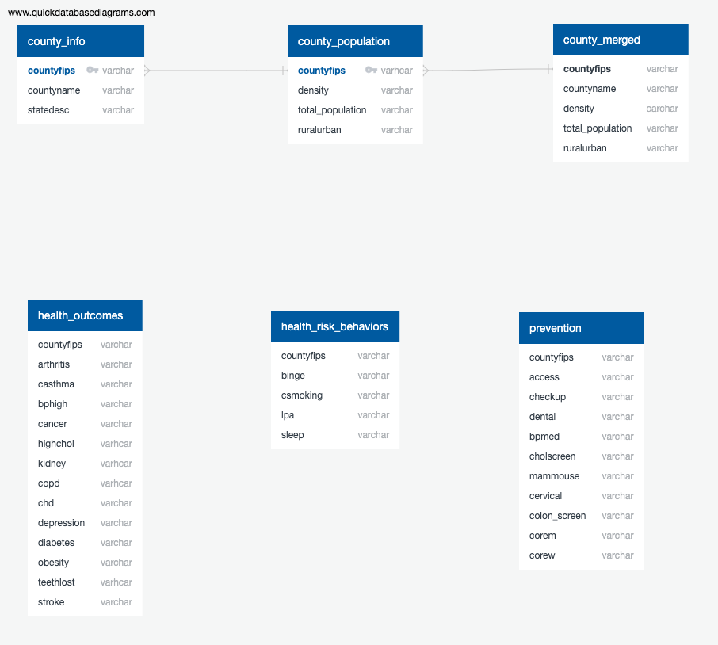

# Final_Project

Topic: US Health

**See our dashboard hosted on Heroku [here](https://b-team-final.herokuapp.com/)** 

## Reason Topic Was Selected:

Health is a topic that affects everyone.  We wanted to better understand how health metrics might differ by location.  The dataset for counties is large and encompases possible variables that may be related to one another. It also includes mapping components.

## Data Source

We are using data from the [2021 Places Census data](https://chronicdata.cdc.gov/500-Cities-Places/PLACES-County-Data-GIS-Friendly-Format-2021-releas/kmvs-jkvx).  This data provides measures related to health outcomes as well as geographic features. The data includes prevention and health risk behaviors for counties in the United States. These are determined by combining various surveys for the same populations. The data is sourced through the The United States Census bureau by counties.

Measure definitions can be view at [Measure-definitions](https://www.cdc.gov/places/measure-definitions/index.html).
The measures are defined as an estimate of the percentage of population in the county who meets certain criteria.

County population data was sourced from the [Social Explorer Market Profile Data 2020.](http://www.socialexplorer.com/pub/reportdata/HtmlResults.aspx?reportid=R13242424).

## Question We Hope To Answer With The Data

### Main Questions

- Can we predict the percentage of the national population that has cancer based on various other categories of health metrics at a county level?
- Are there features related to health: preventive measure, risk behaviors, or other medical outcomes that are correlated to cancer outcomes?

## Slides

https://docs.google.com/presentation/d/15OZkmBjv44i-xoq12jIVcF1bP-0Hgk-oNm7jcBNWap8/edit?usp=sharing

## Tools To Be Used:

- Python
- Jupyter Notebook
- Dash
- Postgres for our database
- AWS to host the data
- Heroku

## Data Exploration And Analysis

We reviewed distributions by using box plots to better understand the various measures in our dataset.   We chose to keep outliers to keep our data's integrity in our analysis. We compared the crude with the age adjusted columns, and determined to keep the age adjusted columns based on our approach of comparing measures accross counties.  We also completed some quick scatterplots and saw that some of the relationships between measures appeared to be linear. 

### Data preprocessing

The dataset that was preproccessed was the **PLACES_County** CSV file. The data was read into a Jupyter Notebook as a DataFrame and filtered to drop confidence interval columns. Next
``dropna()`` was applied to the DataFrame and seperate DataFrames were created to match our created SQL tables. The DataFrames were then imported into an AWS server in a google colab notebook. 

The second dataset that was preprocessed was the **census_county_pop** CSV file. the data was read into a Jupyter Notebook as a DataFrame and ``dropna()`` was applied to drop empty columns. The DataFrame was used to extract population and population densiity data, and joined with other DataFrames to be uploaded into AWS.

## Machine Learning Model

### Feature Engineering

Scaling was not applied to the linear regression data, as all features ranged between 0 and 100. The three DataFrames were combined into a DataFrame and used for the training and testing.

When the logistical regression model was created, cancer rates were iterated through, labeled, and added to the DataFrame as a column to be predicted as the Y variable in the model. The threshold for high risk is created by gathering data that is one standard deviation away from the mean. (This threshold may change). This model was later **dropped**.

### Training and Testing

The model was trained using all data from the three categories created in the preprocessing step joined together. the ``train_test_split`` method from ``sklearn.model_selection`` will be used split the data into testing and datasets. The model will then make predictions on cancer rate based on the testing data.

### Model Choices

A multiple linear regression model will be used to predict cancer rate using the categorized health data as features. R-squared and P-values will be examined to determine effectiveness and confidence of the data's relationships. There is limiations that come with multiple linear regression. Linear regression is very sensitive to outliers and falsely concluding correlation is causation can occur. The benefit of this model is that many features can be used to predict the cancer rate, and it lets the strength of the relationship be assessed between each feature and the prediction.

A logistic regression model was tested to predict high risk (cancer). Catergorized health data will be used as the features, and the dependent variable will be the high risk column. This column will specify if a column has a high rate of cancer that is defined in the feature engineering. A limitation to logisitic regression is the assumption of linearity between the features and the dependent variable. This model was chosen because it also gives importance of each feature, and is less inclined to over-fitting. This model was **dropped** due to the fact that a high risk label can be applied after the linear regression made it's prediction.

### Accuracy

| Metric      | Score |
| ----------- | ----------- |
| R2 Score      | .91       |
| Mean Squared Error | .014 |
| Root Mean Squared Error | .012 |

The model predicts the percentage of population with cancer with a relatively low mean square error value, and an accuracy score above 90%. 

## Databases

- We are using PostgreSQL hosted by AWS. We are creating two tables. One table contains our county variable (Health related data) and the other has a population density data. In addition, we are using PySpark to transform, load and extract before hosting on a remote server.
- The machine learning model will be connected to the database (PostgreSQL).

## Dashboard 

* Description of tools
    * Dash - we will use Dash to create our website and display our findings of the health measures we analyzed in different counties 
* Interactive elelments
    * Interactive map where the user can look at all the counties we have data from that will show information about the health measures we analyzed
    * Pull down menu of the counties that will display the health measures of the area

## Recommendation for future analysis
- Reviewing statistical analysis that could be covered for the site.
- Are there behaviors that can be used to predict a population's medical outcomes such as cancer.
- Is there a difference in medical outcomes for populations based on if they sleep less than 7 hrs a day.
- Are there locations that have differences in their medical outcomes to help identify areas where there may be interventions.
- Does living in metropolitan area lead to higher health risks?
- A specific health factor e.g Is there a correlation between hours of sleep per a night and obesity?
